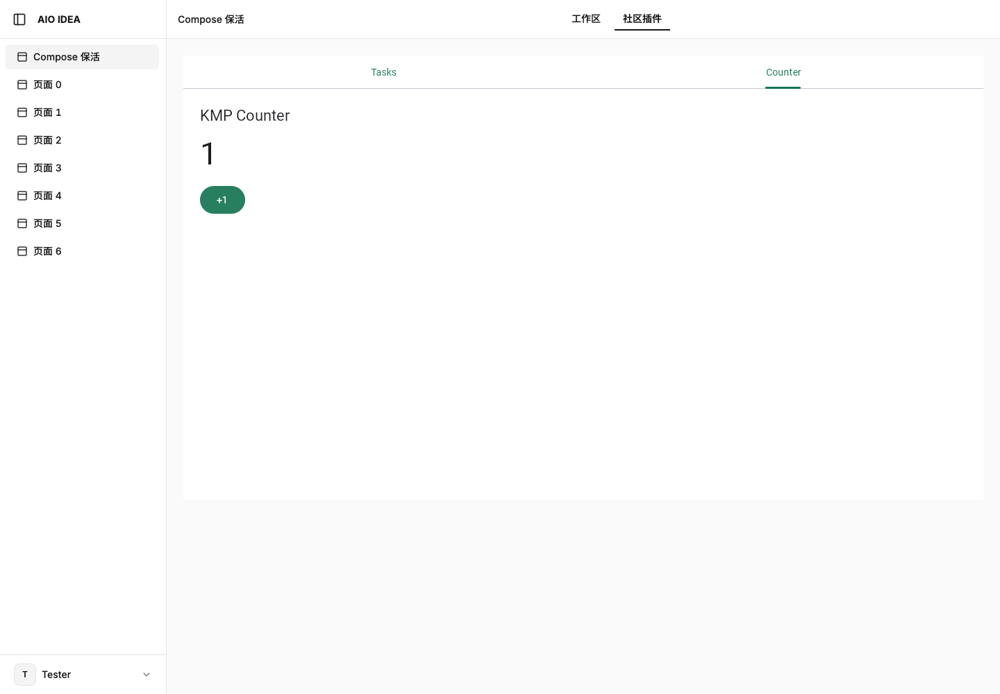

# KMP 全栈示例

一个功能仓库，真实 Compose 前端、Kotlin 后端和共享模型共同发布。壳只挂载隔离页面、转发受限请求和管理整包生命周期，不把 JVM 编进 Rust，也不代画插件控件。



## 自动发布

仓库通过 `aio-delivery.toml` 加入自动交付。推送默认分支后，252 构建服务执行测试、构建并发布完整版本；已安装的壳自动跟随最新通过验证的版本，保留当前 Tasks / Counter 标签。构建失败时继续使用原版本。README 与本地图片随源码提交保存，不依赖 GitHub Actions。

## 模块

```text
frontend/           ComposeViewport + @Composable -> HTML / JS / Wasm / Skia
backend/service/    Ktor JVM -> 独立可执行 JAR
backend/component/  Kotlin Wasm Component -> v2 WIT + 宿主 PostgreSQL 能力
backend/migrations/ Component 计数器的数据库迁移
shared/             无 UI 依赖的请求响应模型
```

根清单选择 Ktor 目标：Tasks 页面读取后端 mock 数据，支持搜索、新增、完成和确认删除；Counter 使用 Compose 本地状态，`onClick { count++ }` 不发送请求，断网可用，切换标签保留，重新加载插件归零。Tasks 的 mock 数据按租户分区，只保存在插件进程内，刷新页面保留，进程重启重置，不用于正式持久化。

## 构建 Ktor 全栈包

```sh
./kotlin test -m shared -p jvm
./kotlin test -m service -p jvm
sh scripts/build.sh
aio plugin package . --git https://github.com/zjarlin/aio-plugin-kmp-example.git --version 0.2.1
```

产物为 `dist/frontend/` 和 `dist/plugin.jar`，打包后同属一个内容摘要。JAR 包含业务及依赖，不包含 JVM。宿主的隔离执行器使用清单锁定摘要的 Temurin 21 JRE 镜像；镜像磁盘层可以复用，各实例仍有独立进程和内存配额。默认最大 Java 堆 96 MiB，不等于进程总内存。

Kotlin Toolchain wrapper 固定 `0.12.0-dev-4233` 及 SHA256，Kotlin `2.4.10`，Compose `1.12.0-beta03`，Ktor `3.5.2`。构建由隔离构建服务完成，生产安装只验证并激活产物。浏览器资源全部随包提供，不使用公网字体或 CDN。

## 本地验证

```sh
AIO_PLUGIN_PORT=8088 java -Xms16m -Xmx96m -XX:MaxMetaspaceSize=80m -XX:+UseSerialGC -jar dist/plugin.jar
npm ci --ignore-scripts
npm run preview
npm run test:browser
```

开发预览默认 `http://127.0.0.1:4189/`，通过同级 `aio-platform/sdk/web` 挂载真实沙箱页面。它只绑定回环地址，使用固定开发租户，不是生产认证入口。测试依赖本机 Chrome，检查桌面/移动端 canvas 像素、任务 CRUD、输入、确认框、计数、刷新和控制台。

## Component 目标

```sh
WIT_BINDGEN=/path/to/wit-bindgen sh scripts/generate-bindings.sh
sh scripts/build-component.sh
```

`backend/component/aio-plugin.toml` 保留 `schema_version = 2`；`dist/plugin.wasm` 不包含 JVM，使用 `counter.html` 作为前端入口。数据库通过宿主参数化查询能力访问，业务代码不持有 PostgreSQL 凭据。官方 WASI adapter 的版本和摘要由构建脚本锁定。

v2 清单不要求填写 `runtime.kind`，由 Component 产物和 WIT 校验决定执行方式。前端、后端和数据库迁移作为同一个版本打包；页面入口由 Kotlin 的 `describe` 提供，不在清单重复定义菜单或子插件。平台 `az-plugin-bundle` 开发工具已能生成和验证整包，尚不接入旧公网发布接口。

v2 Component 的生产校验与发布链仍在迁移，不能用旧 CLI 发布该目标，也不能删除版本标记绕过校验。真实数据库、租户隔离和实例重建测试在平台 `lib/plugin/runtime/tests/component.rs`；`scripts/test-browser.mjs` 对应 Component 开发预览。Ktor 示例的上线不代表整个平台 v2 迁移完成。
